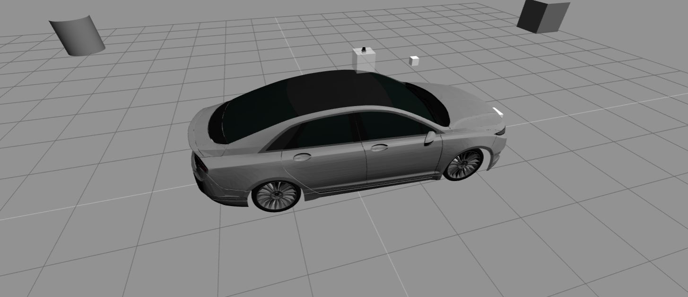
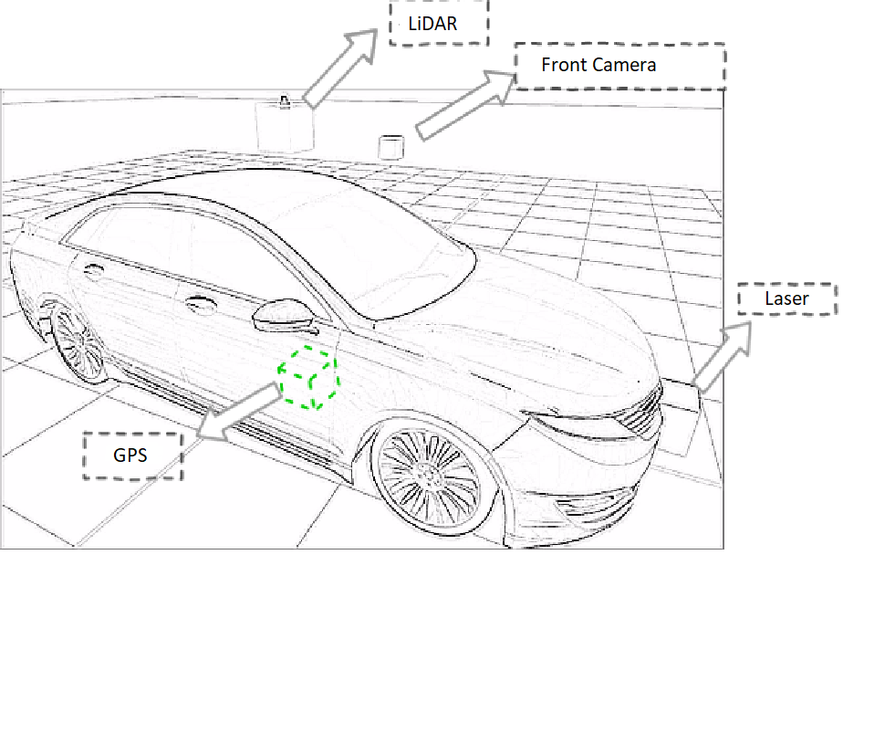
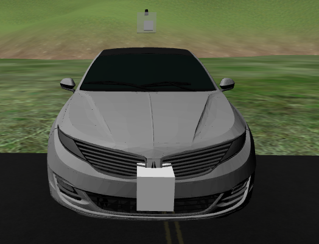
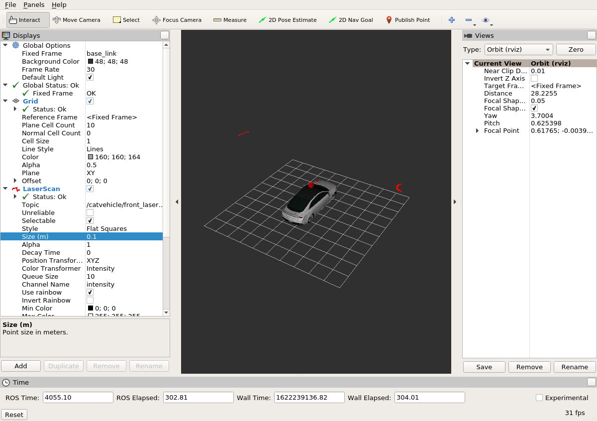

# README #

## ROS for Autonomous Cars ##

### Summary ###

This repository demonstrates the essentials for controlling autonomous cars using ROS. For example:

1. Sensors required for an autonomous car and accessing them using ROS
2. Performing autonomous navigation using a GPS
3. Creating an obstacle-avoider for an autonomous car
4. Interfacing ROS with a car that follows the DBW interface

The focus of the work here is on SAE - Level 3 autonomy.  This means that it is expected that all tasks should be performed autonomously, but at the same time, it is expected that a human driver will intervene whenever necessary. This level of autonomy is called conditional automation.

### Sensor Package ###
The sensors used here to perform basic autonomous vehicle control are the following:

1. Laser
2. Camera
3. LiDAR
4. GPS

### The DBW interface for autonomous cars and CAN-Bus ###

The DBW interface has been used here, which allows communication with real cars through the CAN-Bus protocol. Instead of controlling the car similar to a normal wheeled robot, as is normally the case through Twist topics, here, the state of the steering wheel, brake-pedal, throttle-pedal, and gear selected are published. Just like real cars are controlled.

Then, the DBW infrastructure converts it into CAN-Bus messages and publishes them into CAN-Bus-like topics. Finally, a node will read those CAN-Bus topics and send them to a CAN-Bus device, from which all the car systems will read and publish.

Information in cars is usually communicate through vehicular buses like CAN-Bus (There are others like LIN, MOST, FlexRay, but they are not dealt with here, due to the safety applications based on CAN BUS).

The codebase is based on the dbw_mkz_ros and the CatVehicle Test bed. The simulations have a simulated CAN-Bus driver device that mimics how the real one will work in the exact same way. The only difference will be that, in this simulation, there is not as much information pouring into the CAN-Bus because it is only publishing the essential data for the car to move and navigate.

### How do I get set up? ###

More information about the following will be put up soon. Stay tuned!

* Summary of set up
* Configuration

* Dependencies - 
1. dbw_mkz_ros framework: https://bitbucket.org/DataspeedInc/dbw_mkz_ros

2. ADAS Development kit information:http://dataspeedinc.com/docs/ADAS_Kit.pdf

3. CatVehicle TestBed: https://cps-vo.org/group/CATVehicleTestbed

4. ROS: http://www.ros.org/

5. Gazebo: http://gazebosim.org/

* Database configuration
* How to run tests
* Deployment instructions

### Contribution guidelines ###

More information about the following will be put up soon. Stay tuned!

* Writing tests
* Code review
* Additional simulations

### Who do I talk to? ###

* Repo owner - Vinay Prakash
* Email - vinaypra@mtu.edu